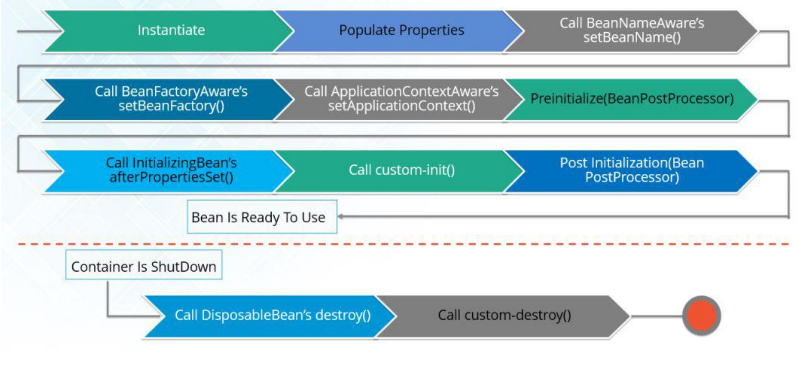

## spring bean 容器的生命周期是什么样的？
spring bean 容器的生命周期流程如下：

* 1、Spring 容器根据配置中的 bean 定义中实例化 bean。
* 2、Spring 使用依赖 注入填充所有属性，如 bean 中所定义的配置。
* 3、如果 bean 实现 BeanNameAware 接口，则工厂通过传递 bean 的 ID 来调用 setBeanName()。
* 4、如果 bean 实现 BeanFactoryAware 接口，工厂通过传 递自身的实例来调用 setBeanFactory()。
* 5、如果存在与 bean 关联的任何 BeanPostProcessors，则调用 preProcessBeforeInitialization() 方法。
* 6、如 果为 bean 指定了 init 方法（ <bean> 的 init-method 属性），那么将调 用它。
* 7、最后，如果存在与 bean 关联的任何 BeanPostProcessors，则将调用 postProcessAfterInitialization() 方法。
* 8、如果 bean 实现 DisposableBean 接口，当 spring 容器关闭时，会调用 destory()。
* 9、如果为 bean 指定了 destroy 方法（ <bean> 的 destroy-method 属性），那么将调用它。

## 自动装配有哪些方式？
Spring 容器能够自动装配 bean。也就是说，可以通过检查 BeanFactory 的内容让 Spring 自动解析 bean 的协作者。

自动装配的不同模式：

* no - 这是默认设置，表示没有自动装配。应使用显式 bean 引用进行装配。
* byName - 它根据 bean 的名称注入对象依赖项。它匹配并装配其属性与 XML 文件中由相同名称定义的 bean。
* byType - 它根据类型注入对象依赖项。如果属性的类型与 XML 文件中的一个 bean 名称匹配，则匹配并装配属性。
* 构造函数- 它通过调用类的构造函数来注入依赖项。它有大量的参数。autodetect - 首先容器尝试通过构造函数使用 autowire 装配，如果不能，则尝试通过 byType 自动装配。

自动装配有什么局限？

    覆盖的可能性 - 您始终可以使用 <constructor-arg> 和 <property> 设 置指定依赖项，这将覆盖自动装配。
    基本元数据类型 - 简单属性（如原数据类型， 字符串和类）无法自动装配。令人困惑的性质 - 总是喜欢使用明确的装配，因为 自动装配不太精确。

